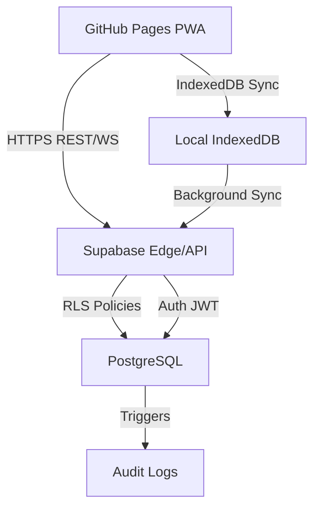

# INSTITUTIONAL BACKEND IMPLEMENTATION GUIDE (LEVEL 3)

---

## 1. INSTITUTIONAL-GRADE ARCHITECTURAL RATING

**Score:** 8.1 / 10

**Critical Justification:**

- **Security:**
  - RLS enforced, but browser-exposed anon keys remain a risk for privilege escalation if policies are misconfigured.
  - No server-side secret management on static hosting; all client secrets must be public or proxied.
- **Data Sync:**
  - IndexedDB <-> Supabase sync is optimistic; race conditions possible on concurrent edits, especially offline/online transitions.
  - No built-in CRDT or operational transform for true multi-device conflict resolution.
- **Scalability:**
  - Supabase/Postgres scales horizontally for reads, but write contention and function cold starts can bottleneck under high concurrency.
- **Disaster Recovery:**
  - Supabase provides PITR and backups, but client-side IndexedDB is not recoverable if device is lost.

**Requirements for 10/10:**

- Implement CRDT/OT for conflict-free multi-device sync.
- Proxy all writes through a hardened backend (not direct from browser).
- Add end-to-end encryption for sensitive fields.
- Integrate automated backup/restore for client-side cache.
- Enforce device/session fingerprinting for all auth flows.

---

## 2. ARCHITECTURAL OVERVIEW & ENVIRONMENT MATRIX

**Data Flow Topology:**



**Environment Variables & Config:**

- `VITE_SUPABASE_URL` (public, required)
- `VITE_SUPABASE_ANON_KEY` (public, required)
- `VITE_SUPABASE_SERVICE_ROLE_KEY` (NEVER exposed to client)
- `VITE_APP_ENV` ("production"/"staging")

**Security Constraints:**

- Only anon/public keys in client bundle.
- All service role operations must be via Edge Function, never direct from browser.
- RLS must default to `deny` all, then allow per-user via `auth.uid()`.

---

## 3. STEP-BY-STEP SUPABASE DATABASE INITIALIZATION (LEVEL 3 DETAIL)

```sql
-- Enable UUID extension
create extension if not exists "uuid-ossp";

-- USERS
create table users (
  id uuid primary key default uuid_generate_v4(),
  email text unique not null,
  created_at timestamptz default now()
);

-- CAMPAIGNS
create table campaigns (
  id uuid primary key default uuid_generate_v4(),
  name text not null,
  area text not null,
  target int not null,
  banner_url text,
  status text default 'active',
  created_at timestamptz default now(),
  updated_at timestamptz default now(),
  owner_id uuid references users(id) on delete cascade
);

-- CLIENTS
create table clients (
  id uuid primary key default uuid_generate_v4(),
  name text not null,
  category text not null,
  address text not null,
  area text not null,
  phone text not null,
  email text not null,
  status text default 'prospect',
  campaign_id uuid references campaigns(id) on delete set null,
  onboarding jsonb default '{}',
  services jsonb default '{}',
  manual_quote int default 0,
  amount_paid int default 0,
  notes text default '',
  created_at timestamptz default now(),
  updated_at timestamptz default now(),
  owner_id uuid references users(id) on delete cascade
);

-- CAMPAIGN ASSIGNMENTS (many-to-many)
create table campaign_assignments (
  id uuid primary key default uuid_generate_v4(),
  campaign_id uuid references campaigns(id) on delete cascade,
  client_id uuid references clients(id) on delete cascade,
  assigned_at timestamptz default now(),
  unique (campaign_id, client_id)
);

-- GOOGLE LISTINGS
create table google_listings (
  id uuid primary key default uuid_generate_v4(),
  client_id uuid references clients(id) on delete cascade,
  data jsonb not null,
  created_at timestamptz default now(),
  updated_at timestamptz default now()
);

-- AUDIT LOGS
create table audit_logs (
  id uuid primary key default uuid_generate_v4(),
  table_name text not null,
  row_id uuid not null,
  action text not null,
  pre_state jsonb,
  post_state jsonb,
  user_id uuid references users(id),
  created_at timestamptz default now()
);

-- Indexes
create index idx_clients_campaign_id on clients(campaign_id);
create index idx_campaigns_owner_id on campaigns(owner_id);
create index idx_clients_owner_id on clients(owner_id);
create index idx_audit_logs_row_id on audit_logs(row_id);

-- RLS Policies
alter table users enable row level security;
alter table campaigns enable row level security;
alter table clients enable row level security;
alter table campaign_assignments enable row level security;
alter table google_listings enable row level security;
alter table audit_logs enable row level security;

-- RLS: Only allow access to own rows
create policy "Users can access own" on users for all using (auth.uid()::uuid = id);
create policy "Campaigns: owner only" on campaigns for all using (owner_id = auth.uid()::uuid);
create policy "Clients: owner only" on clients for all using (owner_id = auth.uid()::uuid);
create policy "Assignments: owner only" on campaign_assignments for all using (
  exists (select 1 from campaigns where id = campaign_id and owner_id = auth.uid()::uuid)
);
create policy "Google Listings: owner only" on google_listings for all using (
  exists (select 1 from clients where id = client_id and owner_id = auth.uid()::uuid)
);
create policy "Audit Logs: user only" on audit_logs for all using (user_id = auth.uid()::uuid);
```

---

## 4. EDGE FUNCTION GATEWAY & WEBHOOK DEVELOPMENT

**File:** `supabase/functions/sync-gateway/index.ts`

```ts
// Deno (Supabase Edge Function)
import { serve } from "std/server";
import { createClient } from "@supabase/supabase-js";

serve(async (req) => {
  const { VITE_SUPABASE_URL, VITE_SUPABASE_SERVICE_ROLE_KEY } = Deno.env.toObject();
  const supabase = createClient(VITE_SUPABASE_URL, VITE_SUPABASE_SERVICE_ROLE_KEY);

  let payload;
  try {
    payload = await req.json();
  } catch {
    return new Response(JSON.stringify({ error: "Invalid JSON" }), { status: 400 });
  }

  // Validate structure
  if (!payload || !payload.type || !payload.data) {
    return new Response(JSON.stringify({ error: "Malformed payload" }), { status: 422 });
  }

  // Deduplication (Levenshtein or hash match)
  // ...implement deduplication logic as needed...

  // Transactional commit
  const { error } = await supabase.rpc("sync_payload", { data: payload.data, type: payload.type });
  if (error) {
    return new Response(JSON.stringify({ error: error.message }), { status: 500 });
  }

  return new Response(JSON.stringify({ status: "ok" }), { status: 200 });
});
```

---

## 5. TRANSACT-SQL AUDIT TRAIL & MULTI-USER UNDO ENGINE

```sql
-- Trigger function for audit log
create or replace function log_audit() returns trigger as $$
begin
  insert into audit_logs (table_name, row_id, action, pre_state, post_state, user_id)
  values (
    TG_TABLE_NAME,
    NEW.id,
    TG_OP,
    to_jsonb(OLD),
    to_jsonb(NEW),
    NEW.owner_id
  );
  return NEW;
end;
$$ language plpgsql;

-- Attach triggers
create trigger audit_clients before update or delete on clients
  for each row execute function log_audit();
create trigger audit_campaigns before update or delete on campaigns
  for each row execute function log_audit();

-- Undo stored procedure
create or replace function undo_action(audit_log_id uuid) returns void as $$
declare
  log_row record;
begin
  select * into log_row from audit_logs where id = audit_log_id;
  if log_row.table_name = 'clients' then
    update clients set
      name = log_row.pre_state->>'name',
      -- ...repeat for all fields...
      updated_at = now()
    where id = log_row.row_id;
  elsif log_row.table_name = 'campaigns' then
    update campaigns set
      name = log_row.pre_state->>'name',
      -- ...repeat for all fields...
      updated_at = now()
    where id = log_row.row_id;
  end if;
end;
$$ language plpgsql;
```

---

## 6. FRONT-END CLIENT SYNC DISPATCHER COUPLING

**File:** `src/lib/syncService.ts`

```ts
import { createClient } from "@supabase/supabase-js";

const supabaseUrl = import.meta.env.VITE_SUPABASE_URL;
const supabaseAnonKey = import.meta.env.VITE_SUPABASE_ANON_KEY;
const supabase = createClient(supabaseUrl, supabaseAnonKey);

export async function syncDraftToCloud(draft: any, type: string, token: string) {
  const controller = new AbortController();
  const timeout = setTimeout(() => controller.abort(), 8000);
  try {
    const res = await fetch(`${supabaseUrl}/functions/v1/sync-gateway`, {
      method: "POST",
      headers: {
        "Content-Type": "application/json",
        Authorization: `Bearer ${token}`,
      },
      body: JSON.stringify({ type, data: draft }),
      signal: controller.signal,
    });
    clearTimeout(timeout);
    if (!res.ok) throw new Error(await res.text());
    return await res.json();
  } catch (err) {
    // Optionally: queue for retry
    throw err;
  }
}

export function onAuthStateChange(callback: (user: any) => void) {
  supabase.auth.onAuthStateChange((_event, session) => {
    callback(session?.user || null);
  });
}
```

---

**END OF GUIDE**
